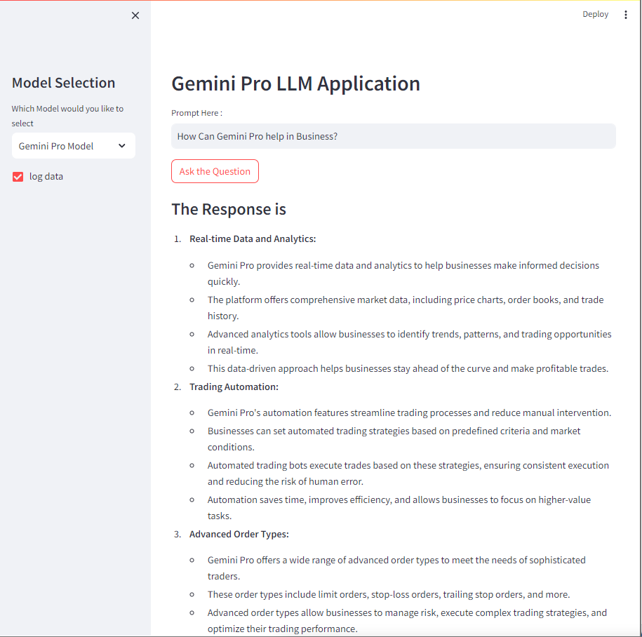
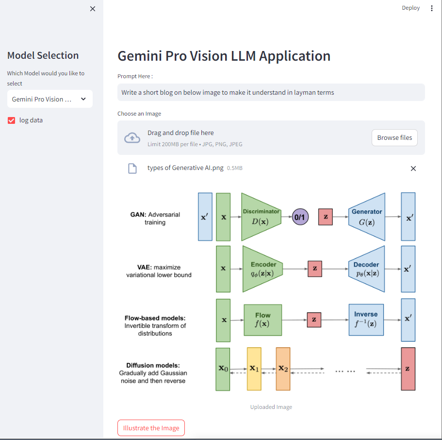
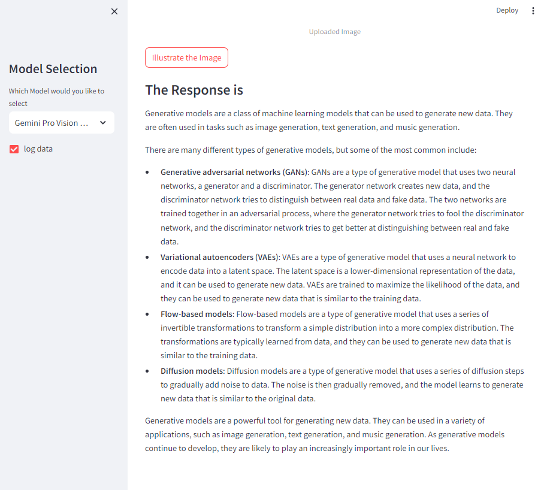

# Gemini Pro LLM Application

This Streamlit application allows users to interact with Gemini Pro Models for natural language understanding and image processing. Users can ask questions or provide prompts to receive responses or image illustrations from the models.






## Prerequisites

Before running the application, make sure you have the following installed:

- Python (version 3.x recommended)
- Required Python packages (install them using `pip install -r requirements.txt`):
  - streamlit
  - google-generative-ai
  - pillow
  - python-dotenv

## Getting Started

1. Clone the repository:
   ```bash
   git clone https://github.com/Mohshaikh23/Gemini-Pro-LLM-App.git
   cd your-repo
   ```

2. Create a virtual environment (optional but recommended):
   ```bash
   python -m venv gemini #gemini is the name of the virtual environment here
   source venv/bin/activate  # On Windows, use venv\Scripts\activate
   ```

3. Install dependencies:
   ```bash
   pip install -r requirements.txt
   ```

4. Set up your environment variables:
   - Create a `.env` file in the project root.
   - Add your Google API key to the `.env` file:
     ```
     GOOGLE_API_KEY=your_google_api_key
     ```

5. Run the Streamlit application:
   ```bash
   streamlit run your_script_name.py
   ```

6. Open your browser and go to `http://localhost:8501` to access the application.

## Usage

- Choose the desired model in the sidebar.
- For the Gemini Pro Model:
  - Enter a prompt/question in the text input.
  - Click the "Ask the Question" button to get a response.
- For the Gemini Pro Vision Model:
  - Enter a prompt/question in the text input.
  - Upload an image using the file uploader.
  - Click the "Illustrate the Image" button to get an illustrated response.

## Additional Information

- The application uses Streamlit for the web interface.
- Gemini Pro Models are powered by the `google-generative-ai` library.

## Notes

- Make sure to keep your Google API key confidential.
- Customize the application as needed for your specific use case.
- Ensure that the models (`gemini-pro` and `gemini-pro-vision`) are correctly defined and accessible.
